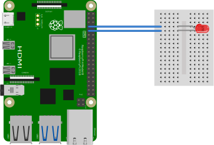

# Build your first Matter device with a Raspberry Pi

This tutorial walks you through setting up a Matter Lighting device on a Raspberry Pi.
We will use the [matter-pi-gpio-commander] snap which contains a lighting app built on top of the Matter SDK.
The application supports communication over WiFi/Ethernet as well as Thread.

<!-- the Lighting App and then commission and control it with the [Chip Tool][chip-tool]. -->

## Hardware
In this guide, we use the following hardware:
- A **PC** running Ubuntu 22.04
- A Raspberry **Pi** 4B with Ubuntu Server 22.04 (64-bit) - but it also works on Ubuntu Core 22
- A 10mm 3v LED



Since we use a large 3v LED, we can directly connect it to the GPIO. We connect the LED to GPIO 4 (pin 7) and GND (pin 9). Refer [here](https://pinout.xyz/), for the Raspberry Pi pinout.

## Setup
In this section, we'll install and configure the [matter-pi-gpio-commander] snap.

SSH to the Raspberry Pi and install the snap:

```bash
sudo snap install matter-pi-gpio-commander
```

### Configure the GPIO

Set the GPIO to 4:
```bash
sudo snap set matter-pi-gpio-commander gpio=4
```

Grant the snap access to the GPIO memory, needed by this application:
```bash
sudo snap connect matter-pi-gpio-commander:gpio-memory-control
```

### Test the GPIO

The application is almost ready to start and join a Matter network.
But before doing so, it is better to test it locally to see if we can control the GPIO via the app:
```bash
sudo matter-pi-gpio-commander.test-blink
```
Take a look at the logs and the LED. If there are no errors and the LED blinks every half second, we are ready to proceed!

### CLI flags

The application supports a range of CLI arguments implemented by the Matter SDK.

For a list of supported CLI arguments, execute `matter-pi-gpio-commander.help`.

```console
$ matter-pi-gpio-commander.help
Usage: /snap/matter-pi-gpio-commander/x3/bin/lighting-app [opti

GENERAL OPTIONS

  --ble-device <number>
       The device number for CHIPoBLE, without 'hci' prefix, can be found by hciconfig.

  --wifi
       Enable WiFi management via wpa_supplicant.

  --thread
       Enable Thread management via ot-agent.

  ...

```

For example, to override the default passcode:
```bash
sudo snap set matter-pi-gpio-commander args="--passcode 1234"
```

Multiple CLI arguments can be concatenated with a space. For example: 
```bash
sudo snap set matter-pi-gpio-commander args="--passcode 1234 --ble-device 1"
```


### DNS-SD

The application uses DNS-SD to register itself and be discovered over the local network.
To allow that we need to manually grant access:
```bash
sudo snap connect matter-pi-gpio-commander:avahi-control
```

````{important}
The above command assumes that the `avahi-control` interface is provided by the system. This isn't always the case.

To make DNS-SD discovery work, the host needs to have a running avahi-daemon
which can be installed with `sudo apt install avahi-daemon`.

On **Ubuntu Core**, the `avahi-control` interface is not provided by the system. Instead, it depends on the [Avahi snap](https://snapcraft.io/avahi).
To use the interface from that snap, run:
```bash
sudo snap install avahi
sudo snap connect matter-pi-gpio-commander:avahi-control avahi:avahi-control
```
````

### Thread 
If using Thread instead of WiFi/Ethernet, set `--thread` as a CLI argument:
```bash
sudo snap set matter-pi-gpio-commander args="--thread"
```

Note that Thread communication requires a Thread Radio Co-Processor (RCP) and
an agent enabling that communication over DBus.

To allow communication with the [OTBR Snap] for Thread management, connect the following interface:

```bash
sudo snap connect matter-pi-gpio-commander:otbr-dbus-wpan0 \
                  openthread-border-router:dbus-wpan0
```      


### Bluetooth Low Energy (BLE)

To allow the device to advertise itself over Bluetooth Low Energy:
```bash
sudo snap connect matter-pi-gpio-commander:bluez
```

BLE advertisement is required when operating the application in Thread mode.

````{important}
BLE advertisement depends on BlueZ which can be installed with
`sudo apt install bluez`.

On **Ubuntu Core**, the `bluez` interface is not provided by the system. 
The interface can instead be consumed from the [BlueZ snap](https://snapcraft.io/bluez):
```bash
sudo snap install bluez
sudo snap connect matter-pi-gpio-commander:bluez bluez:service
```

````


### Start the application

Now, let's start the application service:
```bash
sudo snap start matter-pi-gpio-commander
```

You can monitor the logs with:
```bash
sudo snap logs -n 100 -f matter-pi-gpio-commander
```
Keep it running in a dedicate terminal window. We will commission and control the application in the next section.

## Commissioning
Now that we have our application running, we can go ahead and commission it using a Matter controller.

We will use the [chip-tool] snap which is a CLI Matter controller.

Install the controller on the PC:
```bash
sudo snap install chip-tool
```

Assuming the Pi and PC are connected to the same network, we should be able to commission the device by discovering its IP address via DNS-SD. This way, we don't have to manually enter the IP address.

First, grant the necessary access to chip-tool to discover services via DNS-SD:
```bash
sudo snap connect chip-tool:avahi-observe
```

We are ready to pair:
```bash
sudo chip-tool pairing onnetwork 110 20202021
```
where:
- `110` is the node id being assigned to this device
- `20202021` is the default setup passcode

If this doesn't work, it may be because it has taken too long to reach this step and the device has stopped listening to commissioning requests. Try restarting it on the Pi with `sudo snap restart matter-pi-gpio-commander`.

## Control
There are a few ways to control the device. The `toggle` command is stateless and simplest. 
```
sudo chip-tool onoff toggle 110 1
```
You may need to send this command a few time to make the GPIO output state in sync (see [issue #14](https://github.com/canonical/matter-pi-gpio-commander/issues/14)).


<!-- links -->
[matter-pi-gpio-commander]: https://snapcraft.io/matter-pi-gpio-commander
[chip-tool]: https://snapcraft.io/chip-tool
[OTBR Snap]: https://snapcraft.io/openthread-border-router
