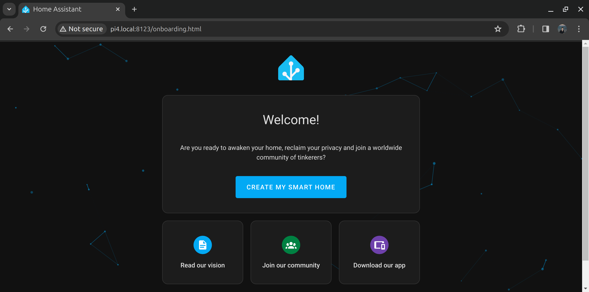
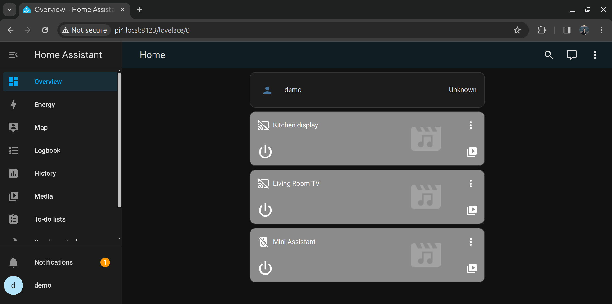
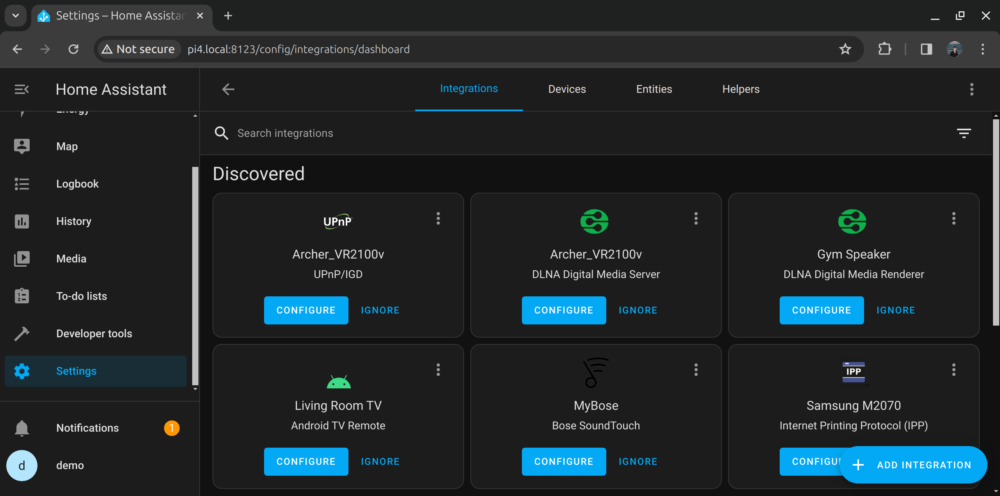

# How to install Home Assistant on Ubuntu Core

caution: A DIY how to. Not for production.

arch: amd64 and arm64
os: Ubuntu Core 22
matter device: Matter smart power plug, link to Pi commander for more DIY
host: Raspberry Pi 4


- Set up the snap
- Set up the configurator
- Set up docker snap
- Run the Matter server container
- Add the matter device
- Control it from the dashboard

## Download and install Ubuntu Core

## Set up the system
SSH to the machine. Assuming that you used the default Ubuntu Core setup with Console Conf, you'll now need to use your Ubuntu username to connect: `ssh <user>@<ip>`.

Take a loot at what is installed:
```console
$ snap list
Name       Version         Rev    Tracking       Publisher   Notes
core22     20230703        821    latest/stable  canonical✓  base
pi         22-2            132    22/stable      canonical✓  gadget
pi-kernel  5.15.0-1048.51  778    22/stable      canonical✓  kernel
snapd      2.61.2          21185  latest/stable  canonical✓  snapd
```
As you see, everything on an Ubuntu Core system is a snap, including the kernel.
At least this is how we start. Later on, we'll also add a Docker container, via a snapped Docker Engine.

Let's prepare the machine for the upcoming work:
```console
# Change the default hostname (ubuntu)
$ sudo hostnamectl set-hostname pi4

# Install the Avahi Daemon, needed for local mDNS broadcasts and mDNS discovery.  
$ sudo snap install avahi
avahi 0.8 from Ondrej Kubik (ondra) installed

# Reboot to make the hostname change effective
$ sudo reboot
```

Now, you should now be able to SSH to the machine via it's hostname: `ssh <user>@pi4.local`

## Install Home Assistant
Home Assistant isn't officially available as a snap. We could deploy their Docker containers but we then need to figure out a way to keep them up to date. Instead, we'll use the Home Assistant snap, which is built and maintained by the community.

Install the latest stable version:
```console
$ sudo snap install home-assistant-snap
home-assistant-snap (2023.12/stable) 2023.12.4 from Giaever.online (giaever-online) installed
```

Verify what resources this snap has access to:
```console
$ snap connections home-assistant-snap 
Interface                Plug                                         Slot                                Notes
bluez                    home-assistant-snap:bluez                    -                                   -
content                  -                                            home-assistant-snap:components      -
content                  -                                            home-assistant-snap:configurations  -
content                  -                                            home-assistant-snap:vscs-content    -
content                  home-assistant-snap:bin                      -                                   -
desktop                  home-assistant-snap:desktop                  -                                   -
hardware-observe         home-assistant-snap:hardware-observe         :hardware-observe                   -
network                  home-assistant-snap:network                  :network                            -
network-bind             home-assistant-snap:network-bind             :network-bind                       -
network-control          home-assistant-snap:network-control          :network-control                    -
physical-memory-control  home-assistant-snap:physical-memory-control  -                                   -
raw-usb                  home-assistant-snap:raw-usb                  -                                   -
removable-media          home-assistant-snap:removable-media          -                                   -
serial-port              home-assistant-snap:serial-port              -                                   -
```

The essential networking interfaces have been connected, which are sufficient for us.
It is possible to remove extra access, or add additional ones. 


Now open the following address via a web browser to start onboarding Home Assistant: http://pi4.local:8123



Follow the wizard to set up your instance. In the end, you will be redirected to the default dashboard with some possible auto-configured devices. In my case, there are a few Chromecast devices:



You can now head over to settings to configure and add other devices:


Home Assistant comes with numerous integrations out of the box, enabling you to add your smart home with little efforts.

That's really it. You now have a fully functional Home Assitant instance, which stays up to date and secure.

